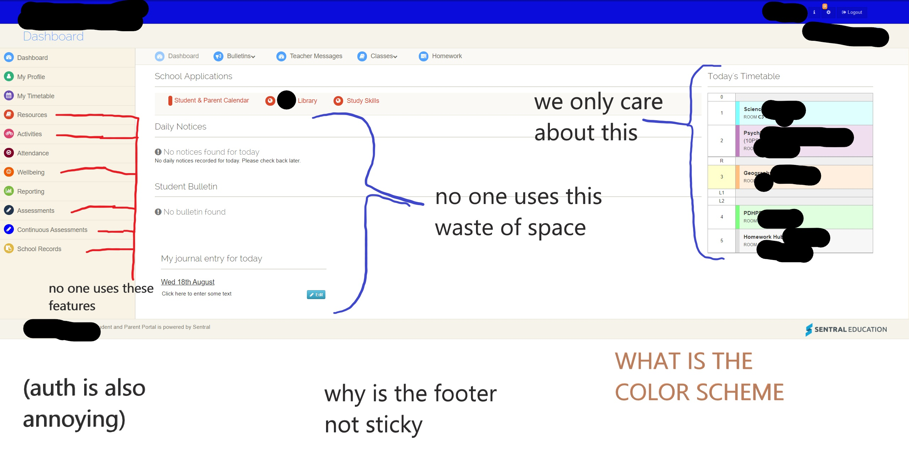
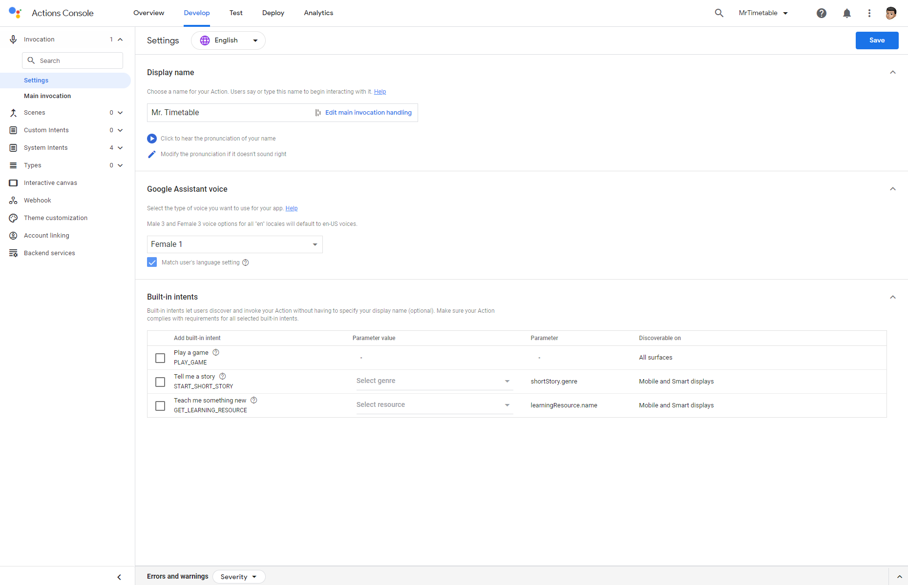
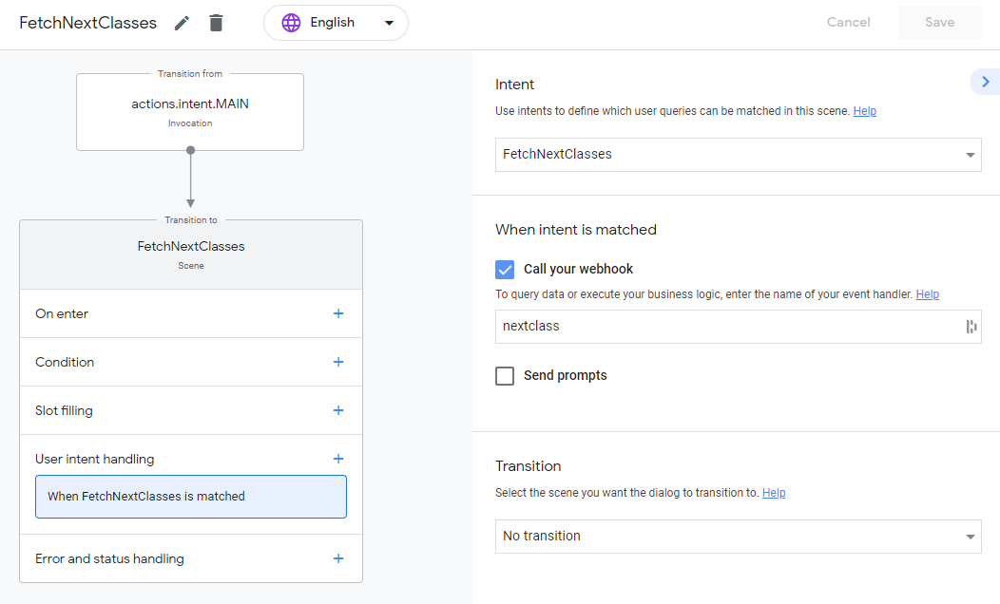
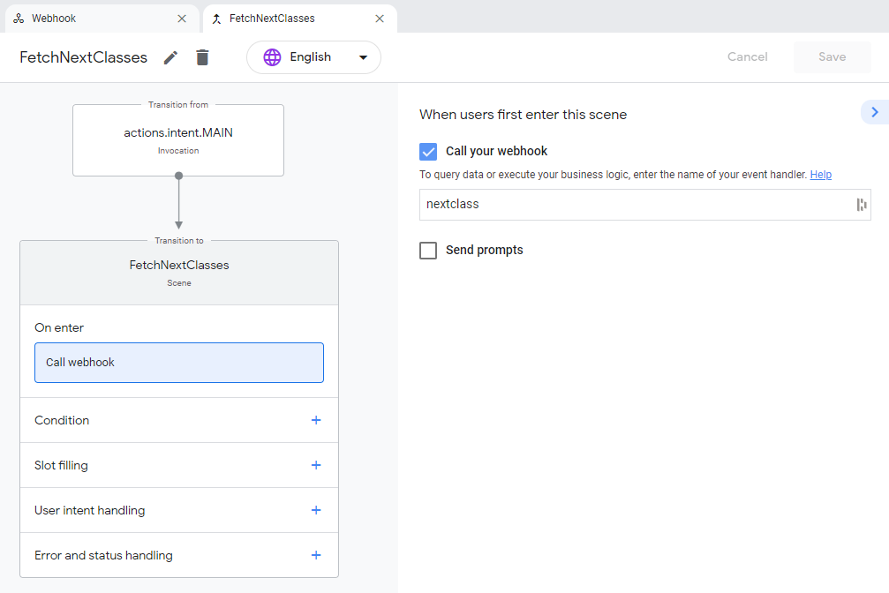
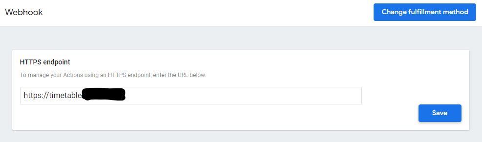
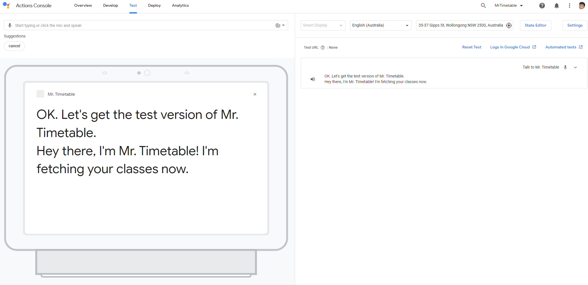
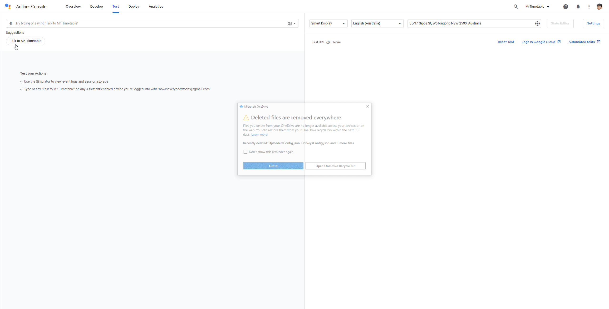

# School Creativity Project 🎨
## The Idea 💡
When in lockdown, to check our timetables online, we have to keep using Sentral, however the Sentral Portal that the school uses is an old version, and doesn't look that good (for that fact, there isn't even a mobile version):



So I'm going to try and make it easier to use the timetable. My idea is to fetch the timetable from Sentral, remember that for the day, and then make that data available for Google Assistant, to use Google Home devices around the home to remind me what class I have next.

## The Plan 📃
1. ✏ Register 'Actions for Google' with my GCP account
2. 💭 Setup the basics of the Actions project.
3. 👨‍💻 Setup an app on my home server, to respond to these requests
4. ⌚ Get the app to detect times of days, and register what times of the day are which periods, and how to interpret data from Sentral
5. 🔍 Create endpoints for the app, and let these fetch the data from the timetable
    - As an extra challenge, cache the results until the end of the day, because the timetable isn't going to change

## The Process 👨‍💻🐱‍💻

### Section 1: Actions for Google 💭
The first step is to create a new project with Actions for Google (Usually, you'd have to setup a GCP account and project etc etc but I already have that). Because this is a unique project (unlike the usual Smart Home or Restaurant type action), I'm going to start from scratch and build my intents manually. Here's the default screen when the console first launches.



I started building the invocation (what gets triggered when I ask for the bot). Since I'm only building this for myself, and I'm not too picky, I don't have to setup other options like suggestions and cards (features for Android devices and Smart Displays). Starting at the main invocation, there's not much to change from the default boilerplate code.



---

#### JSON Response
```json
{
  "candidates": [
    {
      "first_simple": {
        "variants": [
          {
            "speech": "Hey there, I'm Mr. Timetable! I'm fetching your classes now."
          }
        ]
      }
    }
  ]
}
```
_This pretty much just says, when the user asks for 'Mr. Timetable', this is what the bot is going to say first. This isn't much now, but it will be a bit more complex later when we add speech for the classes, and attempt to cleanly exit the bot. I also chose to represent this in JSON over YAML, just because it makes more sense later._

---

I chose to keep the `"speech": "[...]"` section, because it seems a bit awkward to say 'Talk to Mr. Timetable', and then it spits out your classes. The bot would certainly work faster if it just skipped this, but it would also have noticeable loading times, with no response. After it says this, it'll call our webhook (which will be set up later), which will be the way we fetch our timetable data from the server.



We have one final step to get the Action to be talking to our server. I'm going to use a webhook to my own home server (since I already have one setup, and Cloud Functions cost extra $$$). **_The URL points to my real server, and I don't really feel like being DDoS'd anytime soon, so that's why the rest of it is redacted._**



There's real no programming done so far, but pretty much everything is setup now to test the bot (once we make the server). We can test the bot so far in the Test menu. It doesn't really do anything, so I'm going to start building a Node.js app.



### Section 2: Build the Node.js App 👨‍💻

To build the server-side app, I'm using Node.js for four reasons:

- Python is bad
- Node.js is the only runtime supported by the Google team for fulfillment responses (so there's official documentation; technically you can just implement this yourself, but that would take me forever, and would be an absolute waste of time when there's a library already made)
- I'm inheritly biased
- <span style="color:red">_**Python is bad**_</span>

This required a lot of trial and error, and I did screen record my process, but it's over 2 hours and I thought I might just detail what I did here. Some of the above process was changed to adapt to this program, but it's mostly the same.

Firstly, I imported all of the required dependencies, and environment variables file.
```js
const express = require('express');
const bodyParser = require('body-parser');
const puppeteer = require('puppeteer');
const himalaya = require('himalaya');
require('dotenv').config();
const {conversation} = require('@assistant/conversation');
```

Then, we need to be able to handle a request. Since this is pretty large, I've broken it up in different sections.

The first section initiates a version of Google Chromium in 'headless' mode (a version with no actual browser window, usually used in automation). It then travels to the portal login, fills in the username and password, and clicks the submit button.
```js
const app = conversation();
app.handle('nextclass', async (conv) => {
	// Setup Browser
	const browser = await puppeteer.launch();
	const page = await browser.newPage();
	await page.goto(process.env.URL);
	await page.type('#inputEmail', process.env.USER);
	await page.type('#password', process.env.PASSWORD);
	await page.click('.center [type=submit]');
	await page.waitForNavigation({ waitUntil: 'domcontentloaded' });
```

Once it's on the main dashboard page, we can try and interpret the data from Sentral. Because the data is an absolute mess, and doesn't use very good programming/markup practice, the entire timetable is not labelled, and has to be manually travelled to. This was the most tedious part to code, as `periods[i].element.children[3].children[1].children[1].children[1].children[1].children[0].content` and `html[i]?.children[1]?.children[0]?.content` were not very easy to find, and definitely took the longest part of the project.

```js
	// Fetch Timetable Data
	let html = await page.evaluate(() => {
		let element = document.querySelector('.timetable tbody'); // Find the timetable on the screen
		return element.innerHTML;
	});
	html = himalaya.parse(html);
	browser.close();

	// Get today's periods
	let valid = [1, 2, 3, 4];
	let periods = [];

  // Look at each of the rows, and check whether it's an actual period.
	for (var i = 0, len = html.length; i < len; i++) {
		try {
			if (valid.some((e) => e == html[i]?.children[1]?.children[0]?.content.toString())) {
				periods.push({
					id: i,
					period: html[i]?.children[1]?.children[0]?.content.toString(),
					element: html[i]
				});
			}
		} catch (error) {}
	}
```

The above code then outputs the relevant periods in the array `periods`, and would look something like `[1,3,4]` on Mondays, `[2,3,4]` on Thursdays, and `[1,2,3,4]` on every other normal day.
Next, we need to find the names of the classes, and put them into a nice sentence. First, we start with "You have ", and then add classes as we go. Because Sentral lists them as "Geography 10S" or "Mathematics 10S", we need to split the 10S bit, just to know the subject.
Because Sentral also lists Psychology as 'Psych2', there is a check for Regex, so whenever the word 'psych' appears (only when there's a psychology class), it's replaced with the full word Psychology.
Finally, respond to the user with the timetable.

```js
	// Format Nicely
	let msg = 'You have ';

	for (var i = 0, len = periods.length; i < len; i++) {
		let period = periods[i].element.children[3].children[1].children[1].children[1].children[1].children[0].content;

    // Only find the first word
		period = period.split(' ')[0];

    // Replace Psychology
		if (period.match(/Psych/g)) period = 'Psychology';
		if (i == len - 1) {
			msg += `and ${period}.`;
			break;
		}
		msg += `${period}, `;
	}

  // Finally, respond to the user with the timetable.
	conv.add(msg)
});
```

This isn't the most efficient code, and it's just a starting point. I'd like to cache the results, it only works for my school's timetable, there's so much more potential for different fulfillment features, could be deployed for more than one user, and doesn't really have any error handling, but that's a project for another day. In the wise words of [Tom Scott](https://www.youtube.com/watch?v=lIFE7h3m40U "The Art of the Bodge: How I Made The Emoji Keyboard, by Tom Scott"):
> "I'm not writing elegant solutions here, I patch things together. The important stuff- backups, password security- I make sure I get that right... but stuff I'm making for fun, I bodge." - Tom Scott 2015

### Demo:

